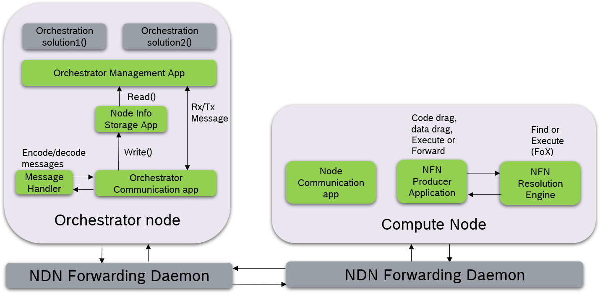

# System Design of the incSIM Module

incSIM is a module for the discrete-event network simulator [ns-3](https://www.nsnam.org/)
making use of other modules including the ns-3 extention [ndnSIM](https://ndnsim.net/current/) (v2.8)
to simulate data-oriented networking protocols of the Named Data Networking architecture.

The incSIM module is structured as follows:

* `apps`: different types of applications able to be deployed on network nodes
to trigger, perform or manage computations. This includes data producer/consumer,
function producer/requestor as well as compute specific forwarding and orchestration
applications.
* `examples/topologies`: provides some exemplary network topologies for simulation.
* `model`: includes a node definition of a compute node within ns-3 including compute node and function properties to be simulated.
* `scratch`: provides pre-defined simulation scenarios and illustrate how to use incSIM.
* `utils`: a set of utility components to generate network topologies, as well as tracers to document the results of simulation runs.

The diagram below illustrates the structure of the incSIM module and its components
deployed as part of the pre-defined simulation scenarios.

